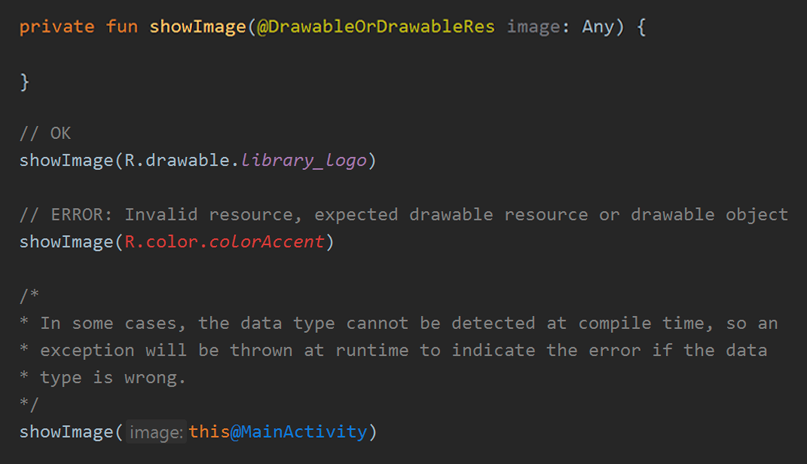
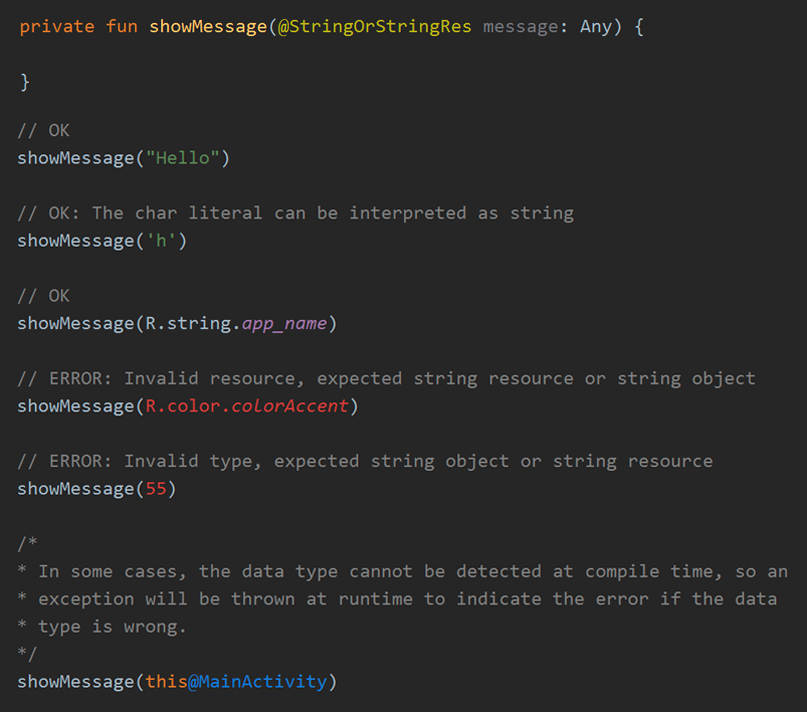

### Description

These annotations are designed to guide the developer on the type of data or resource that can be assigned to a property or variable, the library has 
the [lintcheck](https://github.com/JeovaniMartinez/Android-Utils/tree/master/lintcheck) module that tells the IDE how to verify the use of annotations 
and display warnings in case an incorrect value is detected.

Generally, in these annotations, the expected data type is Any, to give you the flexibility to accept different data types. For example, in some cases 
a String data type is expected, which is processed as is, but an Int data type (which represents the ID) can also be expected and in this case the String 
is obtained from the resources by means of its ID. The library allows this flexibility and is in charge of identifying the type of data and treating it 
appropriately, and if it is an incorrect type of data, an exception is generated.

In some cases, the use of values of the wrong data type cannot be detected at compile time, but an exception will be thrown at runtime if it is detected.

---

## Annotations

### `@DrawableOrDrawableRes`

Indicates that the expected value or object should be a Drawable object or the ID of a drawable resource. For example: `drawableObject`, `R.drawable.demo`.



### `@StringOrStringRes`

Indicates that the expected value or object must be a data type String, Char (since it can be represented as String) or the ID of a string resource. 
For example: `'a'`, `"Hello"`, `R.string.demo`



---

## Custom Implementation

Annotations for code inspection are used by library classes, but you can also assign them to any property or parameter that you require.

In this case, add the required annotation, for example:

```kotlin
private fun showImage(@DrawableOrDrawableRes image: Any) { ... }
private fun showMessage(@StringOrStringRes message: Any) { ... }
```

Then, to process the value, the library has extension functions to get the value easily:

> `typeAsDrawable`<br/>It is a context extension function, allows you to parse the data type and always treat it as a Drawable.<br/><a href="../reference/androidutils/com.jeovanimartinez.androidutils.extensions.context/type-as-drawable.html" target="_blank"><b>[ Reference ]</b></a>

```kotlin
private fun showImage(@DrawableOrDrawableRes image: Any) {
    val finalImage = typeAsDrawable(image)
}
```

> `typeAsString`<br/>It is a context extension function, allows you to parse the data type and always treat it as a String.<br/><a href="../reference/androidutils/com.jeovanimartinez.androidutils.extensions.context/type-as-string.html" target="_blank"><b>[ Reference ]</b></a>

```kotlin
private fun showMessage(@StringOrStringRes message: Any) {
    val finalMessage = typeAsString(message)
}
```
