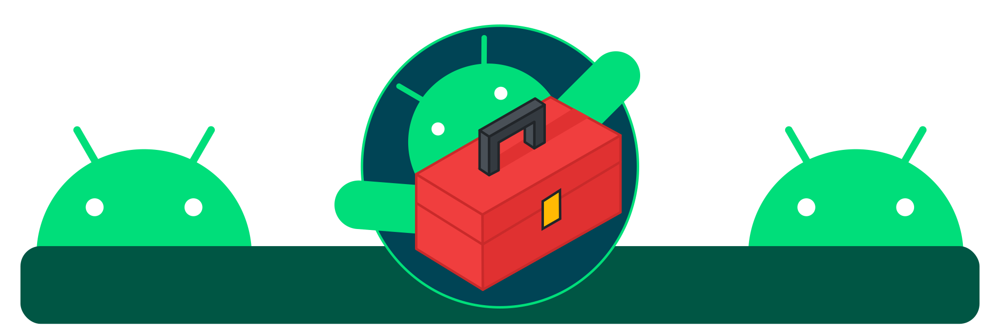

 

### Description

Android utils is a library that groups a set of utilities for Android apps developing.

---

export const Feature = ({children}) => ( {children} );

### Features

- Compatible with Android <Feature>API 17+</Feature>

- Source code written 100% in <Feature>Kotlin.</Feature>

- UI with <Feature>light and dark theme</Feature> support.

- UI with language support for: <Feature>English - Spanish</Feature>

- Free and open-source. <Feature>Apache License 2.0</Feature>

---

### Motivation

Some time ago I started developing Android apps, every time I went from one project to another, there were many parts of
the code of an app that I needed to add to another app and I only needed to make a few minor adjustments, but doing it
manually in each project was time consuming and difficult to maintain.

Hence the idea of ​​creating this library arose, its purpose is to group many common features that are required in most 
apps (share things, show about screen, manage temporary files, etc). so that in each project I could focus on its functionality,
and add this library to use all the common functions, this generates a much more agile and practical development, as well as a code 
base that is easier to maintain and optimize.

I know that my code is not perfect (neither is my english) but I am sure that this library will be very useful to many developers, 
and of course the comments and contributions to the code in the [GitHub](https://github.com/JeovaniMartinez/Android-Utils) repository are welcome.

Sincerely, [Jeovani Martínez](https://github.com/jeovanimartinez)
