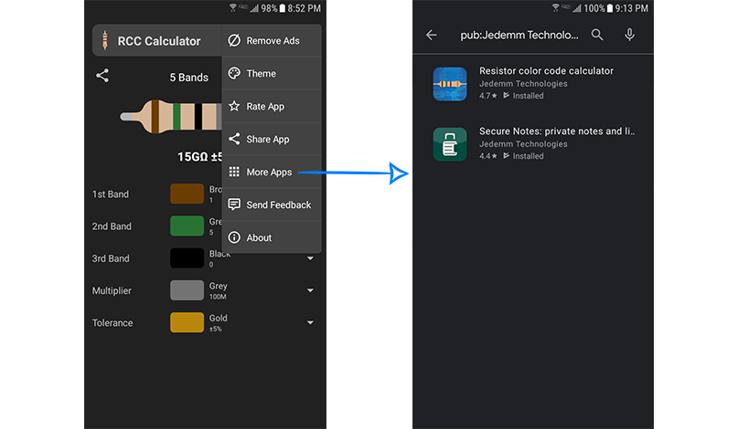

#### <a href="../reference/androidutils/com.jeovanimartinez.androidutils.moreapps/-more-apps-g-play/index.html" target="_blank"><b>[ Reference ]</b></a>

## Description

Utility to invite the user to install the developer apps.

---

## Utilities

### - showAppListInGooglePlay

> #### <a href="../reference/androidutils/com.jeovanimartinez.androidutils.moreapps/-more-apps-g-play/show-app-list.html" target="_blank"><b>[ Reference ]</b></a>

Direct the user to the app developer page on Google Play, usually used to invite the user to install the developer apps.



#### Usage

1.- Set the developer id.

```kotlin
MoreApps.apply { developerId = "Jedemm+Technologies" }
```

2.- Go to Google Play to show the list of apps from the developer.

```kotlin
MoreApps.showAppListInGooglePlay(activity)
```
