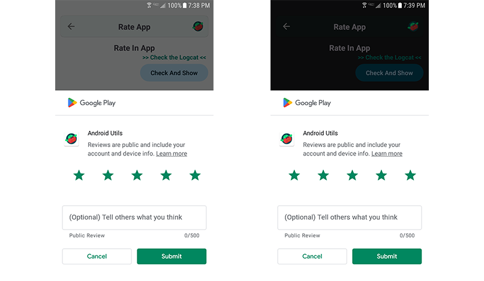

#### <a href="../reference/androidutils/com.jeovanimartinez.androidutils.reviews/-rate-app/index.html" target="_blank"><b>[ Reference ]</b></a>

## Description

Utility to direct the user to app details on Google Play, usually used to invite the user to rate the app.



:::note
If the Google Play app is not available in the device, the user is directed to app details to Google Play website on the system web browser.
:::

---

## Usage

```kotlin
RateApp.goToRateInGooglePlay(activity)
```
