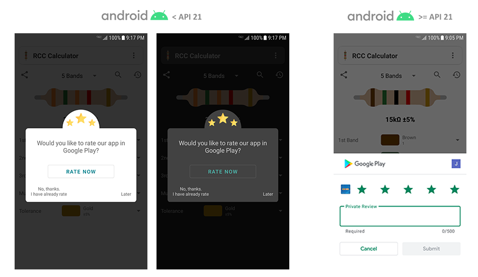

#### <a href="../reference/androidutils/com.jeovanimartinez.androidutils.reviews.rateinapp/-rate-in-app/index.html" target="_blank"><b>[ Reference ]</b></a>

### Description

Utility to show a flow that invites the user to rate the app, based on certain conditions on the use of the app (how many days do it have installed, 
how many times it has been launched, etc.). For Android 5.0 (API 21) and later, the [Google Play In-App Review API](https://developer.android.com/guide/playcore/in-app-review) 
is used, so it can be rated within the app. For versions prior to Android 5.0, a dialog is displayed to invite the user to rate the app, if the user 
accepts, they are directed to the app details on Google Play.




---

### Usage

Either In the `onCreate()` of the singleton or main activity you have to set the configuration values and initialize the utility by passing a context. 
It is very important to do it only once in the app, since at that moment the times the user has launch the app  are counted.

#### <a href="../reference/androidutils/com.jeovanimartinez.androidutils.reviews.rateinapp/-rate-in-app/index.html#%5Bcom.jeovanimartinez.androidutils.reviews.rateinapp%2FRateInApp%2FminInstallElapsedDays%2F%23%2FPointingToDeclaration%2F%5D%2FProperties%2F371564532" target="_blank"><b>[ Configuration parameters  ]</b></a>

```Kotlin
RateInApp.apply {
    minInstallElapsedDays = 10
    minInstallLaunchTimes = 10
    minRemindElapsedDays = 2
    minRemindLaunchTimes = 4
    showAtEvent = 2
    showNeverAskAgainButton = true
}.init(context)
```

Since the utility has been configured, call the next method at the time you want to show the flow to qualify, the flow will be displayed only if the 
conditions specified in the configuration are met.
```Kotlin
RateInApp.checkAndShow(activity)
```
