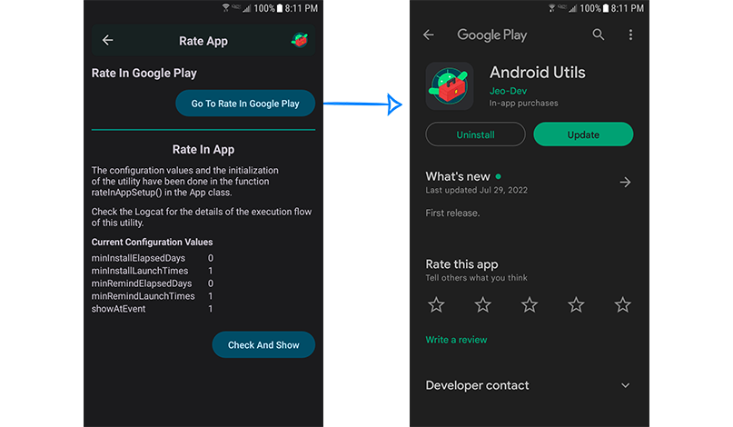

#### <a href="../reference/androidutils/com.jeovanimartinez.androidutils.reviews/-rate-app/index.html" target="_blank"><b>[ Reference ]</b></a>

## Description

Set of utilities to invite the user to rate the app.

> [**Rate In App**](#rate-in-app) This utility invites the user to rate the app based on certain conditions of use of the app.

> [**Rate In Google Play**](#rate-in-google-play) This utility directs the user to the app details on Google Play. It is an alternative to Rate In App,
> which can be used in the app menu and in cases where it is necessary to direct the user to the app details on Google Play directly.

---
---

## Rate In App

### Description

Utility to show a flow that invites the user to rate the app, based on certain conditions on the use of the app (how many days do it have installed, 
how many times it has been launched, etc.). For Android 5.0 (API 21) and later, the [Google Play In-App Review API](https://developer.android.com/guide/playcore/in-app-review) 
is used, so it can be rated within the app. For versions prior to Android 5.0, a dialog is displayed to invite the user to rate the app, if the user 
accepts, they are directed to the app details on Google Play.


---

### Usage

Either In the `onCreate()` of the singleton or main activity you have to set the configuration values and initialize the utility by passing a context. 
It is very important to do it only once in the app, since at that moment the times the user has launch the app  are counted.

> #### <a href="../reference/androidutils/com.jeovanimartinez.androidutils.reviews/-rate-app/index.html" target="_blank"><b>[ Configuration Parameters  ]</b></a>

```kotlin
RateInApp.apply {
    minInstallElapsedDays = 10
    minInstallLaunchTimes = 10
    minRemindElapsedDays = 2
    minRemindLaunchTimes = 4
    showAtEvent = 2
    showNeverAskAgainButton = true
}.init(context)
```

Since the utility has been configured, call the next method at the time you want to show the flow to rate app, the flow will be displayed only if the 
all conditions specified in the configuration are met.
```kotlin
RateInApp.checkAndShow(activity)
```

:::tip
The library provides a detailed flow In the logcat, that you can consult to see the validation of the conditions and perform tests.


:::

:::tip
You can modify the date of your device to be able to run simulate the course of days since the app was installed and perform tests.
:::

---

### Considerations

#### In-App Review API

- It is highly recommended to read the official [In-App Review API documentation](https://developer.android.com/guide/playcore/in-app-review) to 
understand how the API behaves.
- The Google Play In-App Review API has a [limited quota](https://developer.android.com/guide/playcore/in-app-review#quotas) to be able to show the 
flow to rate the app, so on certain occasions, all the conditions may be met, but the flow will be not displayed.
- The app doesn't have to be published to test, but your apps application ID must be available at least in the internal testing track.
- After deleting a revision, it is recommended to clear data and delete cache of Google Play Store app to be able to carry out the tests and that the 
flow shown again.

---
---

## Rate In Google Play

### Description

Utility to direct the user to app details on Google Play, usually used to invite the user to rate the app.


:::note
If the Google Play app is not available in the device, the user is directed to app details to Google Play website on the system web browser.
:::

### Usage

```kotlin
RateApp.goToRateInGooglePlay(activity)
```
