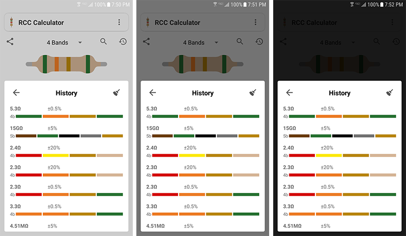
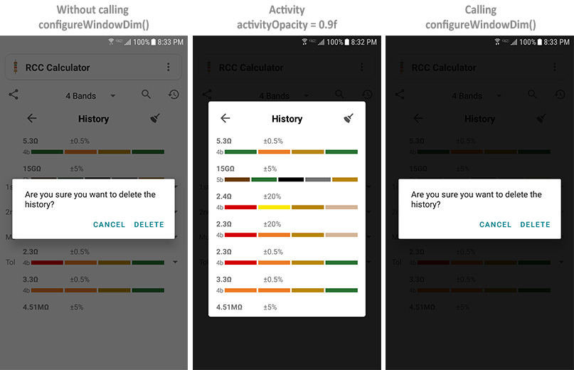

#### <a href="../reference/androidutils/com.jeovanimartinez.androidutils.themes.translucent/-translucent-activity/index.html" target="_blank"><b>[ Reference ]</b></a>

## Description

Style and base class for creating activities with a translucent background.



---

## Usage

:::note
In the layout file, activities that inherit from TranslucentActivity must have a fixed size or a RelativeLayout as the root element in so that 
they occupy the entire screen space.
:::

1.- In the `AndroidManifest` assign the theme `AndroidUtilsTheme.Translucent` to the desired activity.
```xml
<activity
    android:name=".about.AboutActivity"
    android:theme="@style/AndroidUtilsTheme.Translucent" />
```

2.- In the desired activity, inherit from `TranslucentActivity` which in turn inherits from `AppCompatActivity`.
```kotlin
class AboutActivity : TranslucentActivity() { ... }
```

3.- Assign the value to the `activityOpacity` property in the place where you want to adjust the opacity of the activity, so that the activity has the 
background when it starts, you must assign the value before `super.onCreate(savedInstanceState)` in the `onCreate()`. The property can be reassigned 
anywhere and the change is instantly reflected. The value must be between 0 and 1, which corresponds to an opacity of 0% and 100% respectively.
```kotlin {2}
override fun onCreate(savedInstanceState: Bundle?) {
    super.activityOpacity = 0.9f
    super.onCreate(savedInstanceState)
}
```

**[Usage example (design)](https://github.com/JeovaniMartinez/Android-Utils/blob/master/androidutils/src/main/res/layout/activity_about.xml)**<br/>
**[Usage example (code)](https://github.com/JeovaniMartinez/Android-Utils/blob/master/androidutils/src/main/java/com/jeovanimartinez/androidutils/about/AboutActivity.kt)**


---

## Considerations

To produce the best opacity effect in the activity, the `dimAmount` property of the window is used to control the opacity. In some cases (such as when a 
dialog is displayed) it has its own dimAmount value, and when that value is less than the activityOpacity, an unwanted effect is generated in the view. 
To correct this, the TranslucentActivity activity has a special function called `configureWindowDim` that must be invoked when a view is to be displayed 
above of the activity, this corrects this problem and maintains the appropriate opacity. For example, to adjust in a dialog:
```kotlin
val dialog = MaterialAlertDialogBuilder(this@AboutActivity).setTitle("DEMO").show()
configureWindowDim(dialog.window)
```

In the following image you can see an activity with an opacity of 90%, and the effect generated by calling `configureWindowDim` or not.



---
