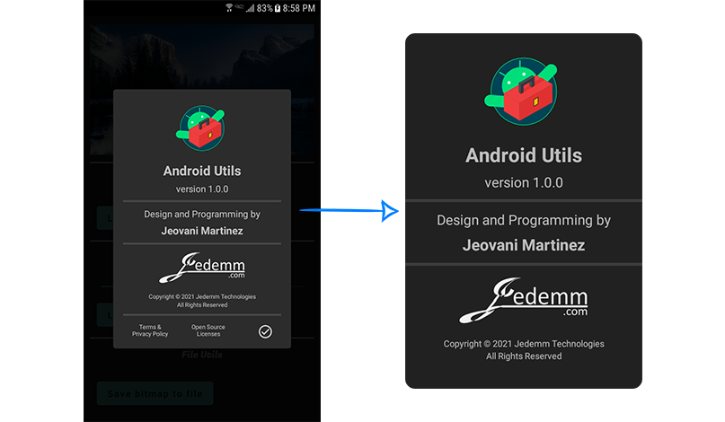
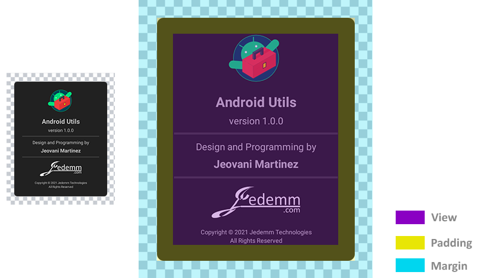
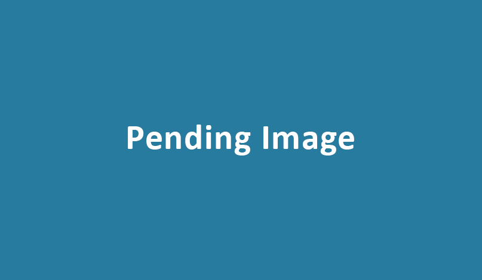

#### <a href="../reference/androidutils/com.jeovanimartinez.androidutils.web/-system-web-browser/index.html" target="_blank"><b>[ Reference ]</b></a>

## Description

Utility for convert views to images. Works for any view and view groups, including layouts with all their children views.



---

## Usage

Call the following function of the utility passing the configuration to generate the image of the view.

> #### <a href="../reference/androidutils/com.jeovanimartinez.androidutils.about/-about-app-config/index.html" target="_blank"><b>[ Configuration Parameters  ]</b></a>

```kotlin
val bitmap = ViewToImage.convert(
    view = about_contentCardLayout,
    backgroundColor = getColorCompat(R.color.colorBackground),
    backgroundCornerRadius = CornerRadius(10f).asDpToPx(context),
    trimBorders = false,
    padding = Padding(0f, 0f, 18f, 0f).asDpToPx(context),
    margin = Margin(0f),
    viewsToExclude = arrayListOf(
        ExcludeView(about_BottomSeparator, ExcludeMode.CROP_VERTICALLY),
        ExcludeView(about_termsAndPolicy, ExcludeMode.CROP_VERTICALLY),
        ExcludeView(about_openSourceLicenses, ExcludeMode.CROP_VERTICALLY),
        ExcludeView(about_closeBtn, ExcludeMode.CROP_VERTICALLY),
    )
)
```

---

## Considerations

## > Padding and Margin

When converting the view to an image, a margin and padding can be specified, the margin is completely independent, and the padding is applied within 
the specified background, for example:



---

## > Exclude Children Views

If the view to be converted to an image is a view group as a layout, by default the generated image includes all children views, however, it is 
possible to pass a configuration to exclude certain children views in different ways.

> ExcludeMode enum defines the ways in which the child view can be excluded from the image.
> #### <a href="../reference/androidutils/com.jeovanimartinez.androidutils.watermark.config/-watermark-position/index.html" target="_blank"><b>[ Reference ]</b></a>
> ---
> ExcludeView define the configuration to exclude a child view from the image.
> #### <a href="../reference/androidutils/com.jeovanimartinez.androidutils.watermark.config/-watermark-position/index.html" target="_blank"><b>[ Reference ]</b></a>

To exemplify the ways in which a child view can be excluded, we will consider the following layout:



### - Hide

> ExcludeMode.HIDE

In this mode, the space occupied by the child view is replaced by the background color.

```kotlin
    // CODE
```


### - Crop Vertically

> ExcludeMode.CROP_VERTICALLY

In this mode, the image of the view is cropped vertically, deleting all the space occupied by the child view.


### - Crop Horizontally

> ExcludeMode.CROP_HORIZONTALLY

In this mode, the image of the view is cropped horizontally, deleting all the space occupied by the child view.


### - Crop All

> ExcludeMode.CROP_ALL

In this mode, the image of the view is cropped vertically and horizontally, deleting all the space occupied by the child view.


