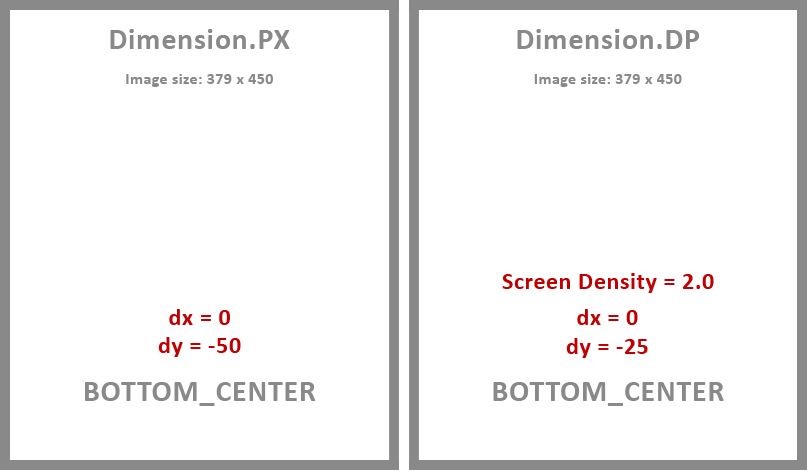

## Description

Utility to draw a text watermark or a drawable watermark into images.

---

## Basic Concepts

### Watermark Position

> WatermarkPosition enum defines the position where the watermark is placed within the image.
> #### <a href="../reference/androidutils/com.jeovanimartinez.androidutils.watermark.config/-watermark-position/index.html" target="_blank"><b>[ Reference ]</b></a>

#### Fixed Positions

The enum defines 9 fixed positions for the watermark, as shown in the following image:

#### Absolute Position

Additionally, the enum has an `ABSOLUTE` position, which allows the watermark to be placed freely within the image. The origin or pivot of the watermark 
is the center of it.

### Offset

> The watermark can have an offset (positive or negative) for the x and y axes.

#### Offset For Fixed Positions

The offset in the fixed positions allows to set a margin for the watermark, and its value must be assigned according to the position, for example:

#### Offset For Absolute Position

The offset in the absolute position, sets the position of the watermark within the image, for example:

### Measurement Dimension

> Dimension enum defines the allowed dimensions for a watermark.
> #### <a href="../reference/androidutils/com.jeovanimartinez.androidutils.graphics.utils/-dimension/index.html" target="_blank"><b>[ Reference ]</b></a>

The configuration values for the watermark are set in px by default, however sometimes it can be useful to want to interpret these values as dp.

In the following example, you can see how the values are interpreted according to the dimension:

