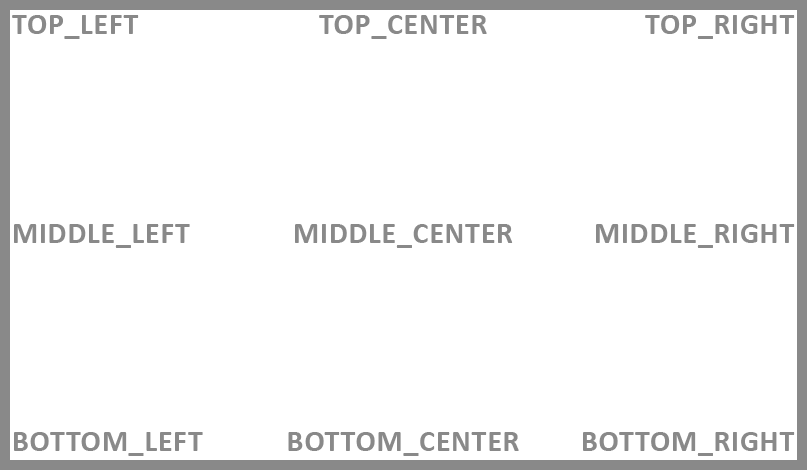
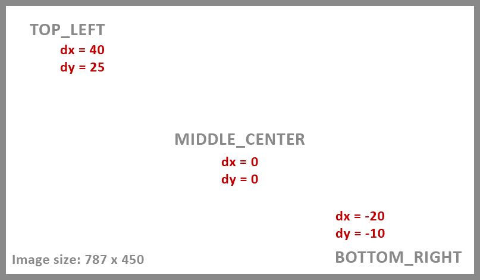
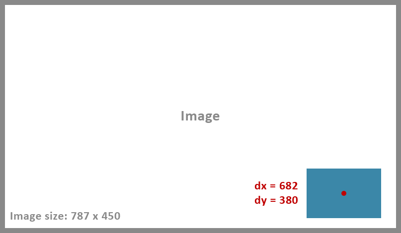

## Description

Utility to draw a text watermarks or a drawable watermarks into images.

---

## Basic Concepts

### Watermark Position

To create a watermark it is necessary to define the position that it will have within the image.

> WatermarkPosition enum defines the position where the watermark can be place within the image.
> #### <a href="../reference/androidutils/com.jeovanimartinez.androidutils.watermark.config/-watermark-position/index.html" target="_blank"><b>[ Reference ]</b></a>

#### Fixed Positions

The enum defines 9 fixed positions for the watermark, as shown in the following image:

#### Absolute Position

Additionally, the enum has an `ABSOLUTE` position, which allows the watermark to be placed freely within the image. The origin or pivot of the watermark 
is the center of it.

---

### Offset

When creating a watermark, it is also necessary to define its offset, both for the x and y axis. This offset can be negative, zero or positive, and 
its interpretation is according to the position of the watermark.

#### Offset For Fixed Positions

The offset in the fixed positions allows to set a margin for the watermark, and its value must be assigned according to the position, for example:

#### Offset For Absolute Position

The offset in the absolute position, sets the position of the watermark within the image, for example:

---

### Measurement Dimension

When set the properties for the watermark, you can specify the `measurementDimension`, the default is in pixels (PX), but sometimes it can be useful to 
use density-independent pixels (DP).

> Dimension enum defines the allowed dimensions for a watermark.
> #### <a href="../reference/androidutils/com.jeovanimartinez.androidutils.graphics.utils/-dimension/index.html" target="_blank"><b>[ Reference ]</b></a>

For example, in the following image we define a text watermark, in the `BOTTOM_CENTER` position, if we want a margin in y-axis of 50 px, for `Dimension.PX`
we must set dy to -50. But if we use `Dimension.DP`, we must set dy to -25, since the density of the screen is 2.0 and that -25 will be converted to pixels 
at the moment of drawing the watermark.

:::note
Measurement dimension applies only to the following watermark properties:
- dx
- dy
- width
- height
- textSize
- shadow
:::

:::caution
`Dimension.SP` is allowed for the `measurementDimension` property, however it is **not recommended** to use it, since if, for example, the device uses a font size larger 
or smaller than the default, this will cause an unwanted change in the dimensions of the watermark. Even for the textSize property of the text watermark, 
it is recommended to use Dimension.DP, since the size will depend on the density, but not on the scale of the text.
:::
